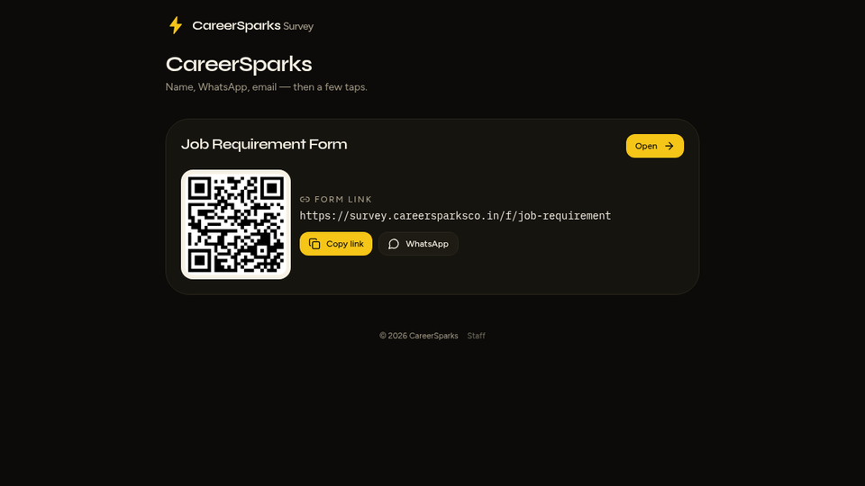

# CareerSparks Survey

<p align="center">
  <a href="https://survey.careersparksco.in/"></a>
</p>

<p align="center">
  <a href="https://survey.careersparksco.in/"><strong>Live demo → survey.careersparksco.in</strong></a>
</p>

<p align="center">
  
  
  
  
</p>

**CareerSparks Survey** is a recruitment survey app for Indian hiring teams.

Share a job-requirement form by link, QR, or WhatsApp. Candidates fill it on phone. Staff review answers in an admin dashboard. Your data stays in your MySQL database — not a locked SaaS.

## Who it is for

- Recruiters who need a **job requirement form** fast
- Hiring teams tired of Excel / Google Form chaos
- Agencies that want a simple **staff admin** without buying an ATS

## Features

| Area | What you get |
|---|---|
| Public forms | Job-requirement / recruitment surveys |
| Easy share | Copy link · QR code · WhatsApp button |
| Staff admin | Login, review responses, manage forms |
| Data | Answers in **MySQL** on your Hostinger plan |
| Auth | Staff login with Better Auth |
| Hosting | **Node.js 22** app |

## Live demo

**[https://survey.careersparksco.in/](https://survey.careersparksco.in/)**

Form example: [Job Requirement Form](https://survey.careersparksco.in/f/job-requirement)

## Stack

Node.js · TypeScript · MySQL · Better Auth · Hostinger

## SEO keywords

recruitment survey India · hiring forms · job requirement form · HR survey tool · Node.js MySQL admin · CareerSparks · open source recruitment forms

## Run locally

```bash
git clone https://github.com/SandeshL702/careersparks-survey.git
cd careersparks-survey
cp hostinger.env.example .env   # your values only — never commit .env
npm install
npm run build:hostinger
npm start
```

## Deploy on Hostinger

1. Add a **Node.js** website (not WordPress)
2. Connect this GitHub repo · Node **22**
3. Build: `npm run build:hostinger` · Start: `npm start`
4. Create MySQL in hPanel
5. Set env vars from `hostinger.env.example` (strong secrets)

Push to `main` rebuilds production.

## Security

- Secrets only in Hostinger env vars
- `.env` is gitignored
- Use a strong `BETTER_AUTH_SECRET` and admin password
- Never commit DB passwords or API keys
